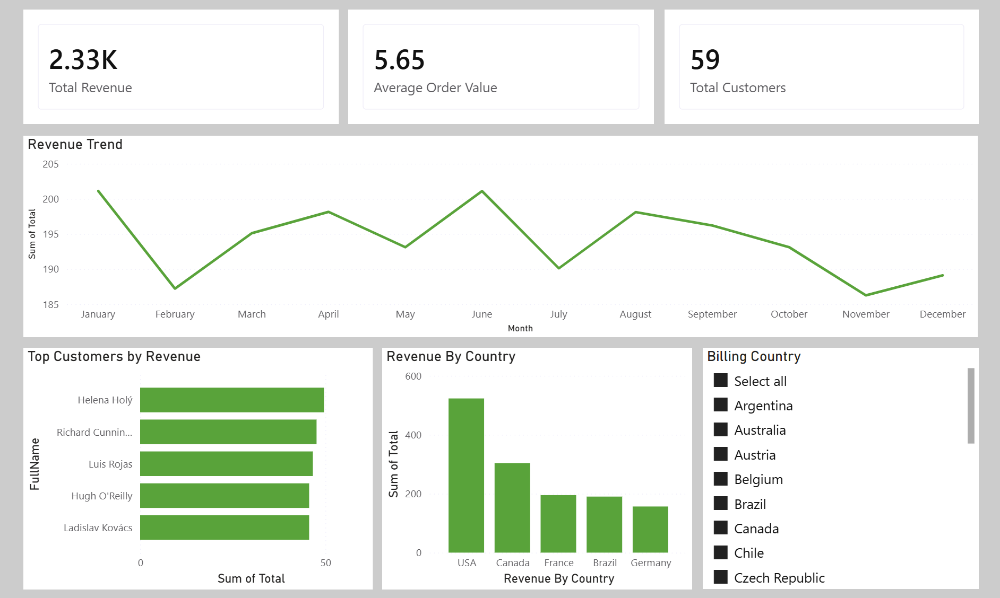

##Dashboard Preview

#Customer Analysis using SQL & Power BI

##Project Overview
This project focuses on analyzing customer purchase behavior using SQL. 
The Chinook database was used to extract insights related to revenue, customer segmentation, and sales trends.

##Tools Used
- SQLite (DBeaver)
- Power BI
- GitHub

##Dataset
- Chinook Database (sample music store dataset)
- Contains tables like customers, invoices, and invoice_items

##Key Analysis Performed

1. Revenue Analysis
- Calculated total revenue
- Analyzed monthly revenue trends

2. Customer Insights
- Identified top customers
- Found repeat customers
- Calculated average order value

3. Market Analysis
- Revenue by country
- Identified highest revenue-generating region

4. Product Analysis
- Top-selling products

5. Customer Segmentation
- Categorized customers into High, Medium, and Low value

##Key Insights
- Top Customer: Helena Holý
- Highest Revenue Country: USA
- Identified high-value and repeat customers
- Revenue trends show business growth patterns over time

##Project Structure
